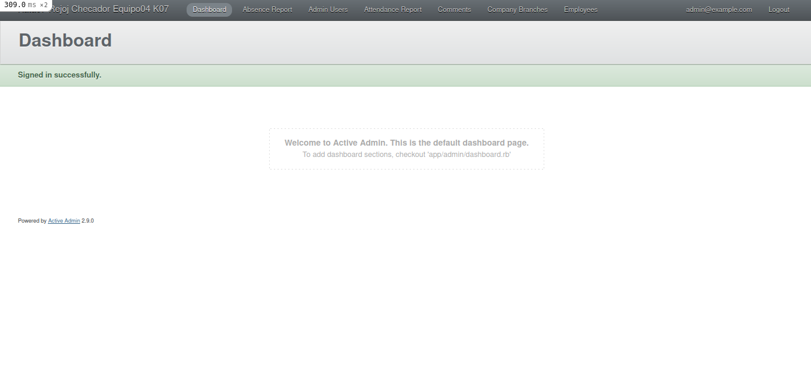
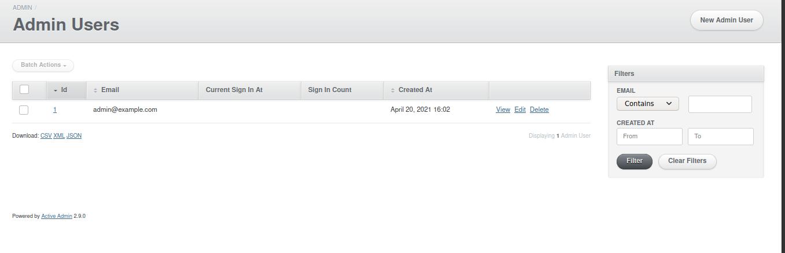
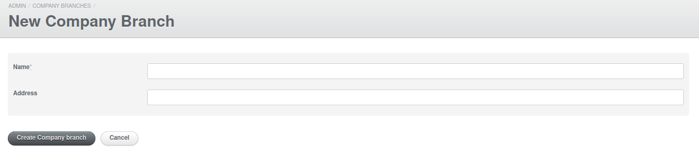
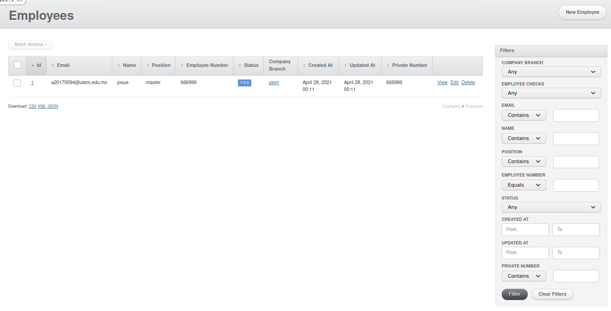
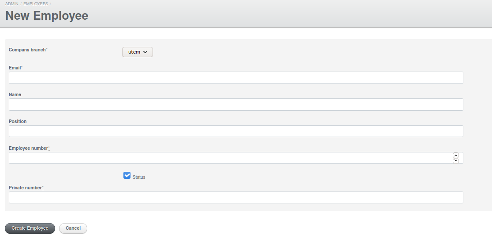

# Reloj Checador App

## Pre-requisitos

Antes de iniciar debes instalar las siguientes herramientas, evaluar tu código e identificar posibles mejoras.

- [Instalar y utilizar Rubocop](https://github.com/bright-coders/commons/tree/master/topics/rubocop)
- [Instalar y utilizar Rubycritic](https://github.com/bright-coders/commons/tree/master/topics/rubycritic)
- [Instalar y utilizar SandiMeter](https://github.com/makaroni4/sandi_meter)

## Requerimientos funcionales

Foo Corp needs a system to control their employees attendance to their offices, they need full visibility of who went to work at what time and when they left. They need a webpage that will be opened in a tablet at the lobby of each branch, where the employee can go in and specify their private number and the system will record internally the time they checked in and the time they checked out.

The attendance web app must meet the following reuqirements:

- Admin
  - Admin portal protected with basic auth
  - Manage employees (CRUD operations)
    - Deactivate employees instead of deleting them
    - Store: email, name and position, employee #, private number
  - Manage Company branches (CRUD operations)
    - Store: name, address
  - Reports
    - Attendance by day
    - Average time employees checked in/out by month
    - Absence report by month
- Frontend
  - Employee registration page
    - Private number input screen
    - Feedback to employee on successful/failed registration

## Requerimientos no-funcionales
- Calidad
  - Utilizar estilo de código definido por la comunidad (apoyarse en Rubocop)
  - Pruebas unitarias
  - Puntuación en Rubycritic: por lo menos 90 en la carpeta de la App y por lo menos 65 en la carpeta de pruebas
  - Utilizar SandiMeter para analizar el código y utilizar el resultado para hacer mejoras
  - Presentación correcta en las versiones más recientes de los principales navegadores: Edge, Chrome, Safari y Firefox
- Deployment
  - Configuración de un servidor web (heroku o similar) para el deployment automático de actualizaciones de la app
  - [Configuración de un servidor de integración continua como Travis CI o Circle CI](https://circleci.com/features/ruby/)
- Frontend
  - CSS: libertad para utilizar cuaquier framework o librería, preferentemente SASS
    - Por ejemplo puedes utilizar Bootsrap junto con [bootstrap_form](https://github.com/bootstrap-ruby/bootstrap_form) para tus formularios

## Tecnologías
- Ruby on Rails en el backend
- PostgreSQL como base de datos principal
- CSS: libertad para utilizar cuaquier framework o librería, preferentemente SASS
  - Por ejemplo puedes utilizar Bootsrap y junto con [bootstrap_form](https://github.com/bootstrap-ruby/bootstrap_form) para tus formularios
- Javascript: libertad para utilizar cualquier framework o librería, preferentemente sin jQuery
- Framework para pruebas [Rspec](https://rspec.info/) ó [Minitest](https://github.com/seattlerb/minitest)

## Entregable
- Código fuente en Github 
  - Debe incluir README con información sobre como configurar el proyecto
  - Los commits de Git deben ser significativos
- Demo de la App correndo en heroku o similar
- Libertad para utilizar cualquier diseño, imágenes, etc, que considere necesarios y apropiados

## Setup
En [este elnace](setup/README.md) se describen los pasos necesarios para ejecutar/probar este proyecto, así como los integrantes de este equipo

## Enlaces
[Encuentra aquí una lista completa de recursos de ayuda](https://github.com/bright-coders/commons/tree/master/topics/resources)

# Tegnologies 
this prollect was make in **Ruby on Rails**
## Dependences

Flexible authentication solution for Rails with Warden.

`gem 'devise'`

creating of formularies 

`gem 'activeadmin'`

**manager of databases **
**postgreql**
In this case this database was selected postgreql 
# installation
### **Need exec this commands for install this app**

**install dependences**
`bundle install`

`yarn install`

**Create database**
`rails db:create`

**Run Migration**
`rails db:migrate`

**Create user**
`rails db:seed`
this coman createtades user  of tests, you can change the password or delete user and create new users
**run the  app**
`rails s`

## User Manual
You need go in this url [home](127.0.0.1:3000 "home")

### Check in and Check out
write your code  for check in and check out 

### Login
For login  you need put user an password

### Home
This is  a page of Home. In this page you whatch a menu in a nav var  with  options of navigate.

### Absence Report
You can seach users for date or expor CSV

In this table you can see  the users

### Admin Users
In this page you see the admin users, the user show a  user in tablet and a menu of filter.

####  Add New User Admin
You can create a new  user with a email and password

###  Attendance Report
In this page you can see a attendance report and  for look with date and export CSV

### Company Branches
In this page you can see that company branches and filter with menu of  search on right

#### New Company Branches
for add a new company branches,  you need a name and address

### employees
In this page you can see that employees and filter with menu of  search on right

In this page you can add a new Employee and you need emails, Employee number, Private number

this prollect is runing in heroku [Page](http://heroku  "Page")