# Technologies 
This project was made with **Ruby on Rails** framework and uses postgreSQL as DB.

## Dependences

Flexible authentication solution for Ruby On Rails.

`gem 'devise'`

Plugin for generating administration style interfaces.

`gem 'activeadmin'`

Open source object-relational database system.

**postgreSQL**
 
# Installation
### **Need exec this commands for install this app**

**Install dependences with**
```bash
bundle install
yarn install
```
**Create database**
```bash
rails db:create
```
**Run Migrations**
```bash
rails db:migrate
```
**Seed database with data**
```bash
rails db:seed
```
It creates a default user in the database, so you can access with the following credentials:

`user: admin@example.com`

`password: password`

You can change the password or delete this user and create a new one.

If you wanto to save some time you can only run 'setup' command and the above commands create, migrate, and seed will be run.
```bash
rails db:setup
```

**Run the app**
```bash
rails s
```
Now you can access to your local server and use the app.

# Test
This app uses rspec testing framework with rspec-rails gem so you only have to run:
```bash
rspec
```
System, requests and models are covered.

# Live Demo
You can acces to a live demo app in the following [heroku page](https://herokuapp.com).

# Authors
- Brayan Diaz C. [brayandiazc](https://github.com/brayandaizc)
- Jose R. Fierro. [Magic-Kowel](https://github.com/Magic-Kowel)
- Carlos Montiel. [Carlos-Montiel](https://github.com/Carlos-Montiel) 

# User Manual
When you visit the [home](http://127.0.0.1:3000 "home") url, you will see the check in/out page.

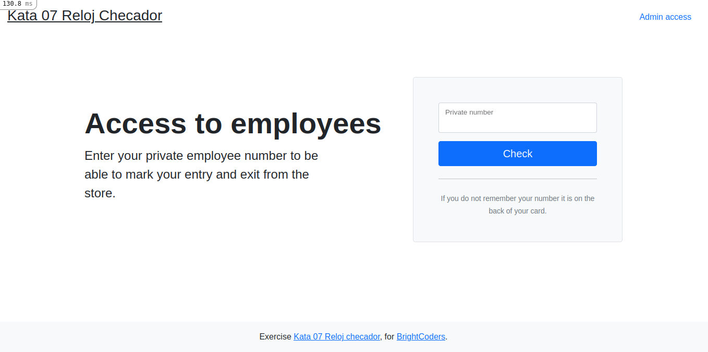

### Check in and Check out
To register your check in/out you only have to type your employee private number and click Check button. 

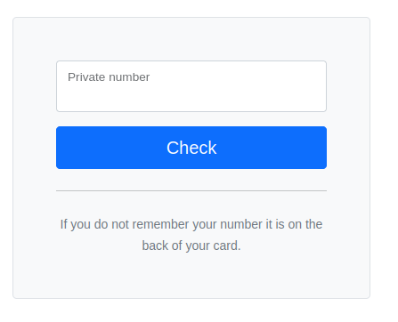

### Login in admin portal
To login in admin portal you need to click in the 'admin access' link located at the top right side and type your user and password in the login form.

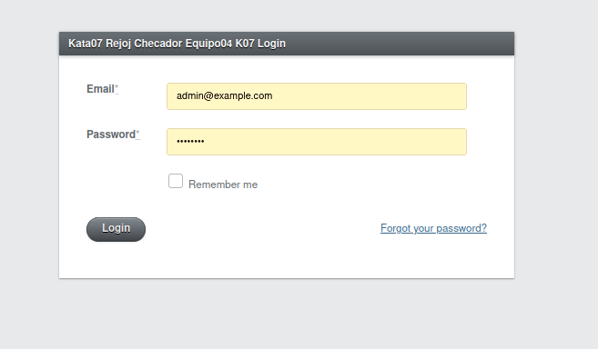

### Home
This is the Home page. In this page you'll see a menu and a navbar with options to navigate.

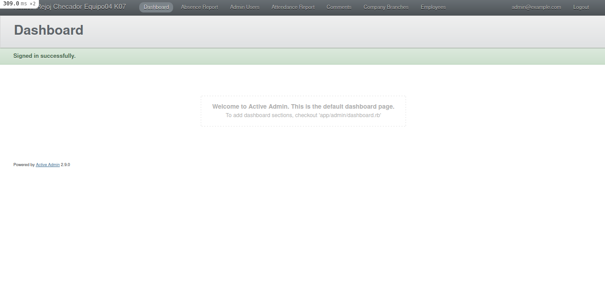

### Absence Report
In this page you can generate a report of the employees absences in the given month and export it to a CSV file.

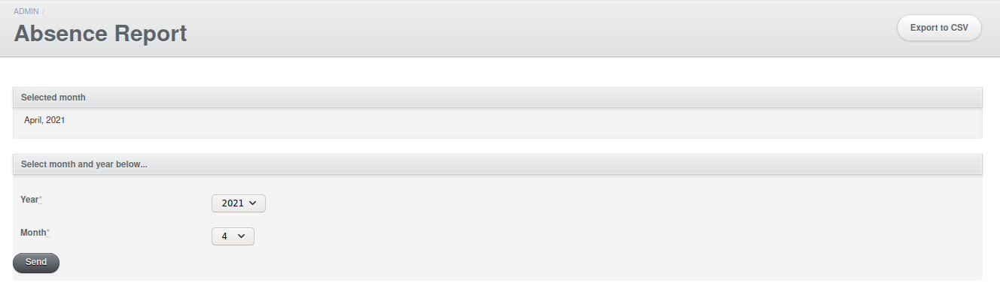
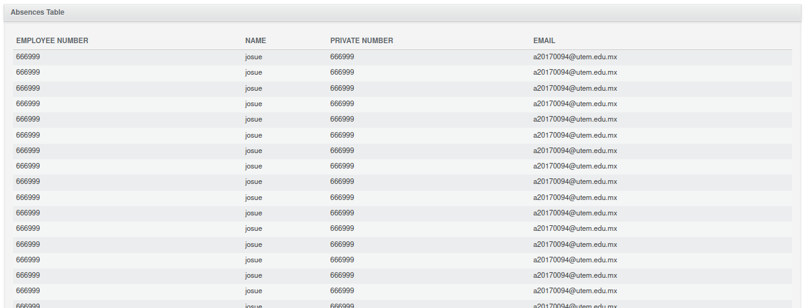

### Admin Users
In this page you'll see the existing admin users.

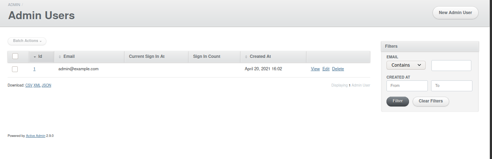

####  Add New User Admin
You can create a new user with an email and password.

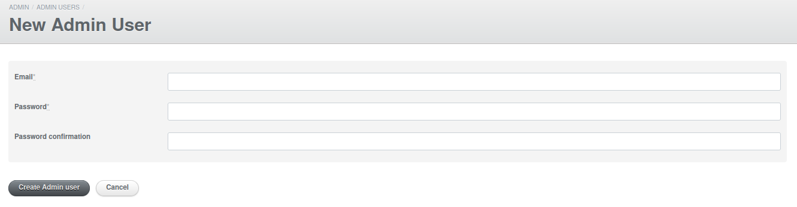

###  Attendance Report
In this page you can see an attendance report when selecting a day in the search form.

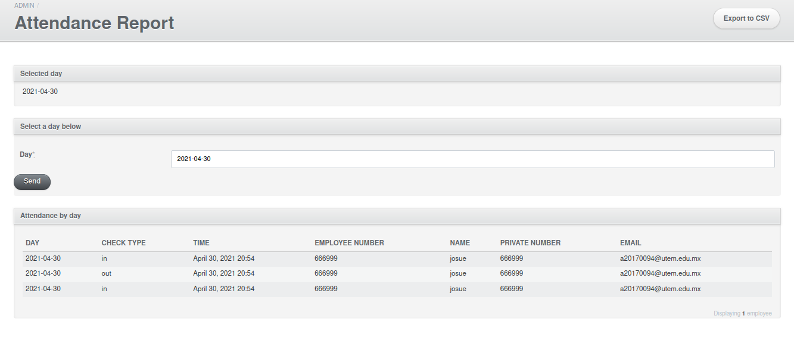

### Company Branches
In this page you can see the existing company branches and filter them with the search form on the right.

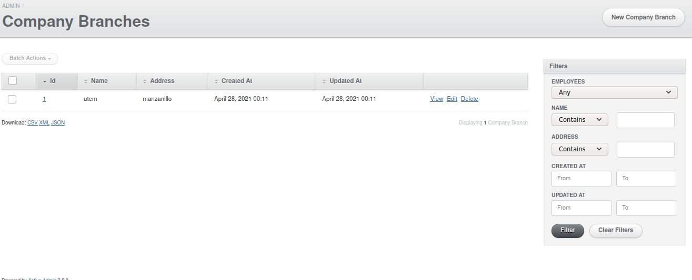

#### New Company Branches
To create a new company branch, you need a name and an address.

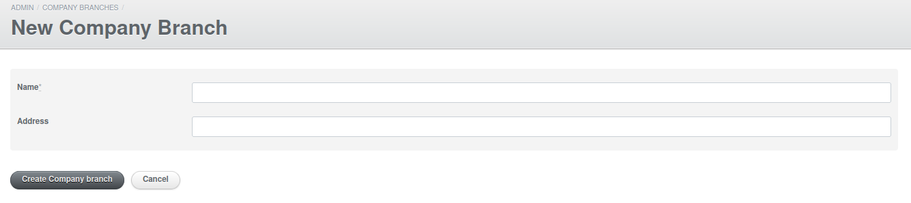

### Employees
In this page you can see the existing employees and also filter them with the search form on the right.

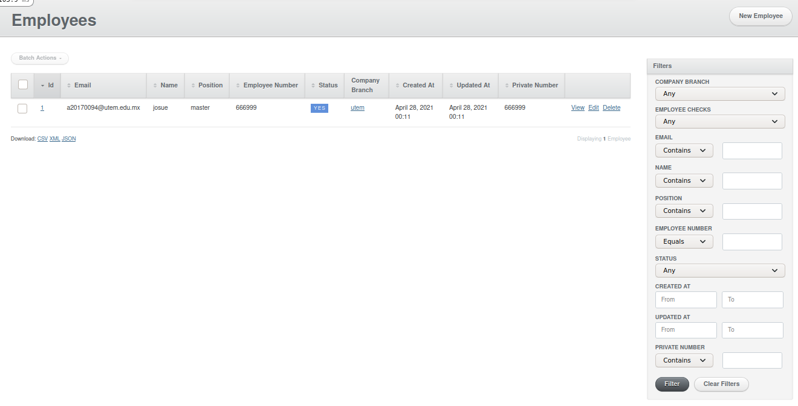

In this page you can create a new Employee.

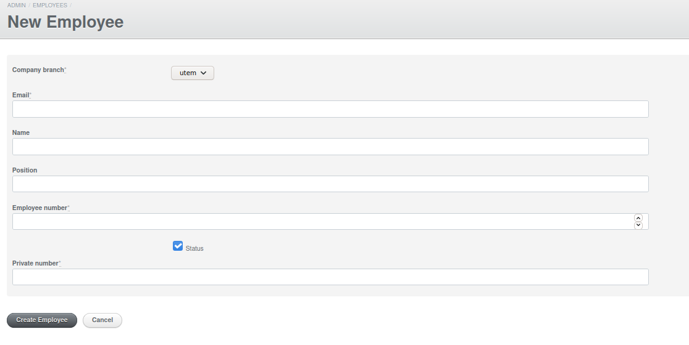
